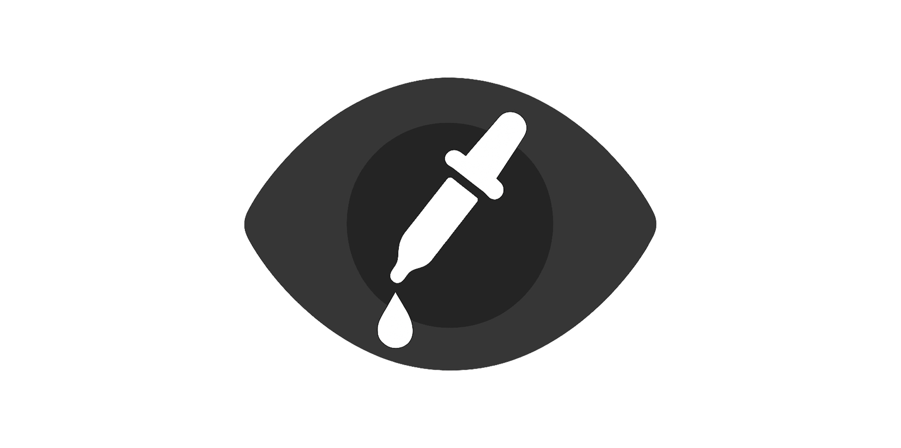
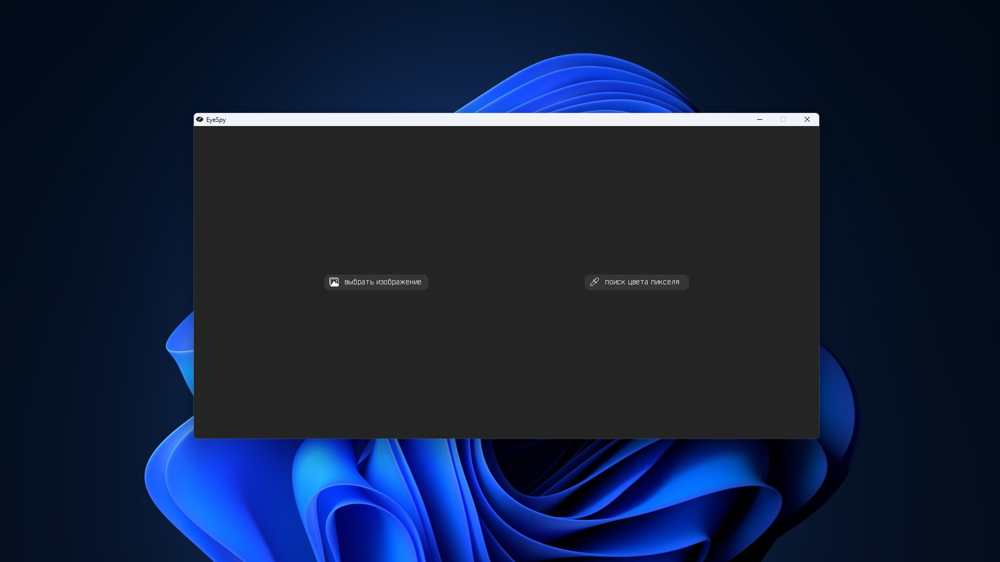
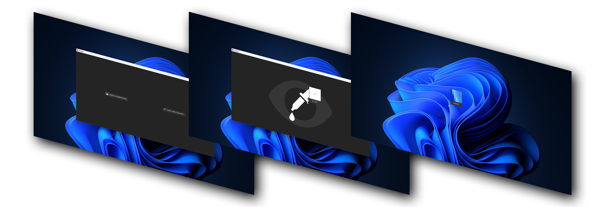

# EyeSpy
Программа поиска цвета пикселя на вашем экране или выбранной фотографии.

A program that searches for the color of a pixel on your screen or a selected photo.

## Установка (Windows) / Installation (Windows)
1. Скачайте zip архив с любой версией / Download the zip archive with any version
2. Разархивируйте в любое удобное место / Unzip to any convenient location
3. Откройте папку EyeSpy / Open the EyeSpy folder
4. Запустите EyeSpy.exe / Run EyeSpy.exe

## Документация / Documentations
Документация на русском языке - [RU](./docs/files/documents_ru.md)

Documentation in English - [EN](./docs/files/documents_en.md)

## Лицензия и распространение программы / License and distribution of the program

[LICENSE](./LICENSE)

## Версии / Versions

Выбрать версию программы - [Версии](https://github.com/1xtrade/EyeSpy/releases)

Select the program version - [Versions](https://github.com/1xtrade/EyeSpy/releases)
